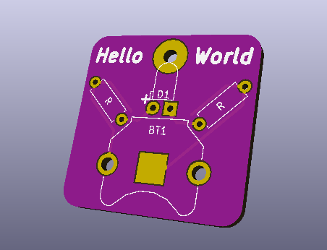

Introduction
------------

[Teardown](images/Teardown2018.jpg)

In programing, "Hello World" is the first program you write when you are learning a new language, so here it is for printed circuit boards.  This was for a one hour talk at [Teardown 2018](https://www.crowdsupply.com/teardown/portland-2018#schedule) in Portland, Oregon. Video of the presentation is on [Youtube](https://youtu.be/aWO80QdqLBQ).

Bill Of Materials
-----------------
  
- 1 ea. Battery Holder, Keystone 3001, https://www.digikey.com/short/jmtqqd
- 1 ea. 3mm LED, https://www.digikey.com/short/jmtqj0
- 2 ea. 100 ohm resistors 1/4w, https://www.digikey.com/short/jmtqz7
- 1 ea. CR1220 battery, http://a.co/1LbhIgT
- 1 ea. tie tack (optional) http://a.co/7cv3B0N

Design Files
------------
This project is designed using Open Source [KiCad](http://kicad-pcb.org/). Design files are located in the [design_files](design_files/) folder.  

Firmware
--------
None

Assembly Instructions
---------------------
Check out Adafruit's excellent [soldering tutorial](https://learn.adafruit.com/adafruit-guide-excellent-soldering/).

License
-------
[Attribution-ShareAlike 3.0 United States (CC BY-SA 3.0 US)](https://creativecommons.org/licenses/by-sa/3.0/us/)

You are free to:

- Share — copy and redistribute the material in any medium or format
- Adapt — remix, transform, and build upon the material

Under the following terms:

- Attribution — You must give appropriate credit, provide a link to the license, and indicate if changes were made. You may do so in any reasonable manner, but not in any way that suggests the licensor endorses you or your use.
- ShareAlike — If you remix, transform, or build upon the material, you must distribute your contributions under the same license as the original.
